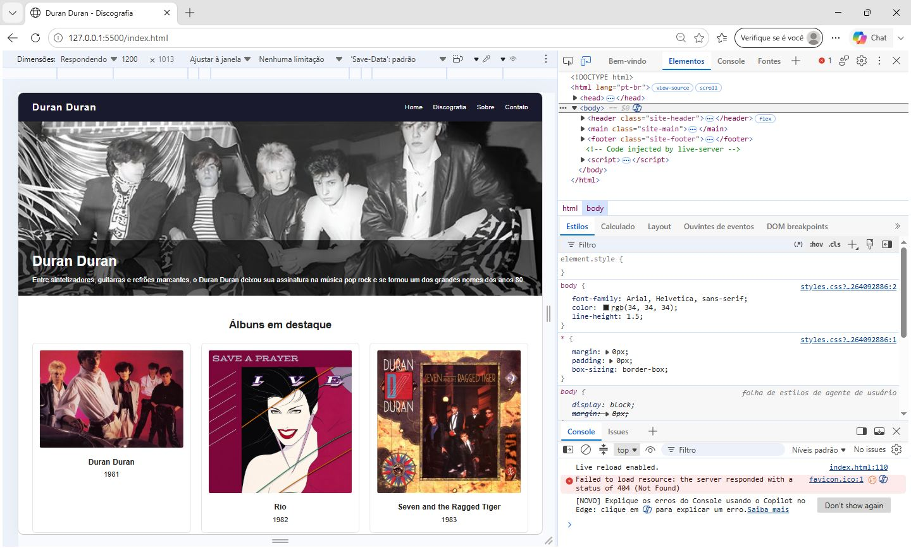
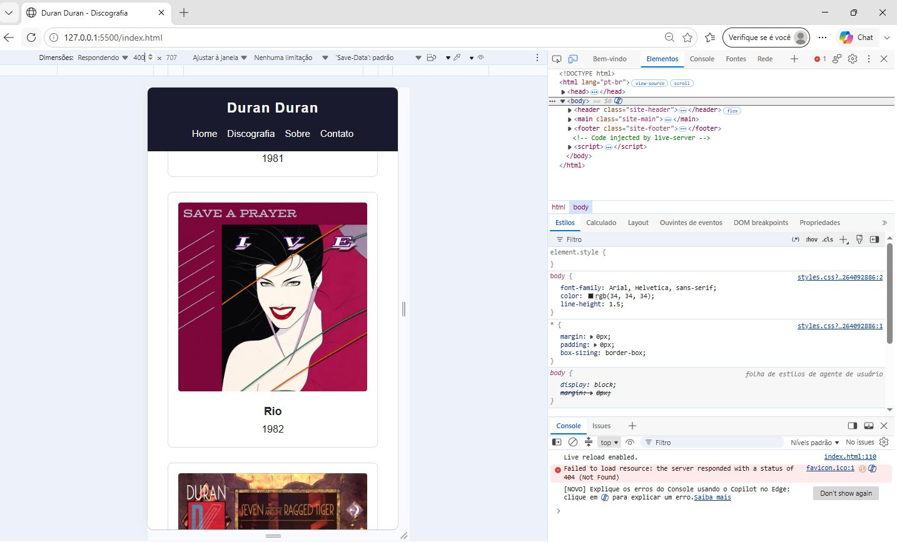
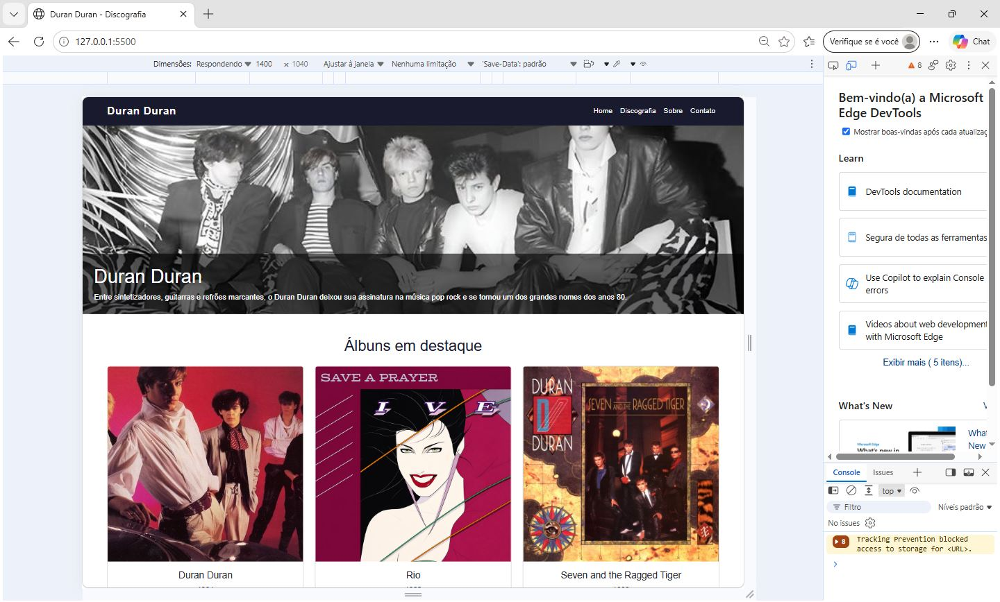
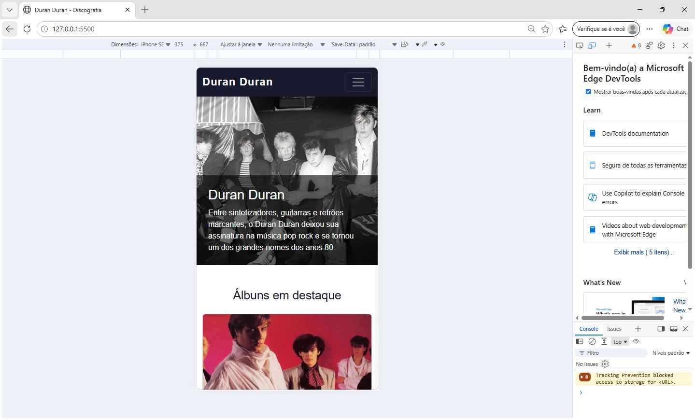

# duran-duran-HomePage

## Dados do aluno

**Nome:** Cibele Batista Gomes
**Matrícula:** 1640681  

## Projeto

Home Page sobre a banda Duran Duran, desenvolvida utilizando HTML e CSS.

## Tecnologias utilizadas

- HTML5
- CSS3
- Git
- Bootstrap 5
- GitHub
- Visual Studio Code

## Responsividade

A Home Page possui uma versão desktop e uma versão mobile, utilizando CSS puro, Media Queries e Grid.

### Desktop

### Mobile

## Responsividade com Bootstrap 

Nesta etapa, a Home Page foi refatorada substituindo Media Queries, Flexbox e Grid nativos pelo framework Bootstrap. 

### Desktop 

### Mobile 

